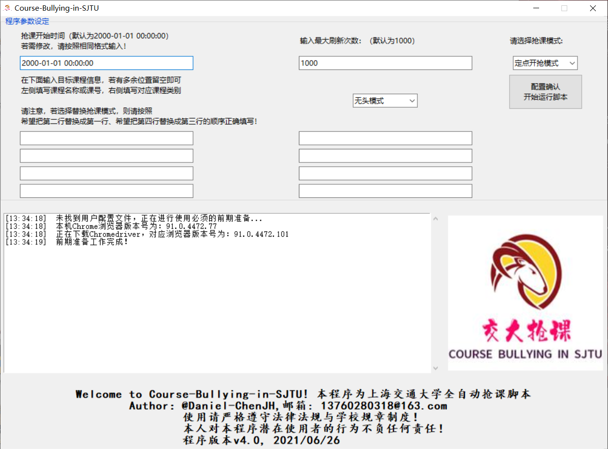
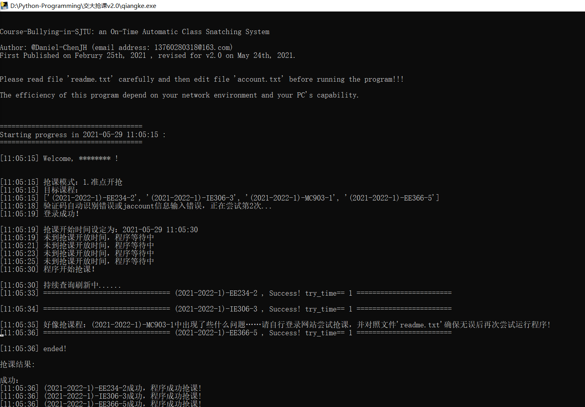
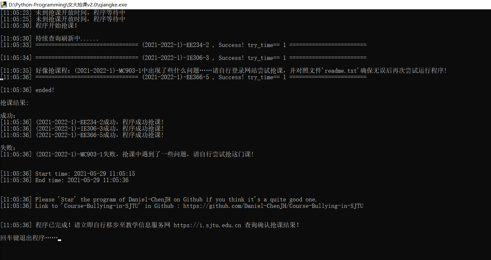
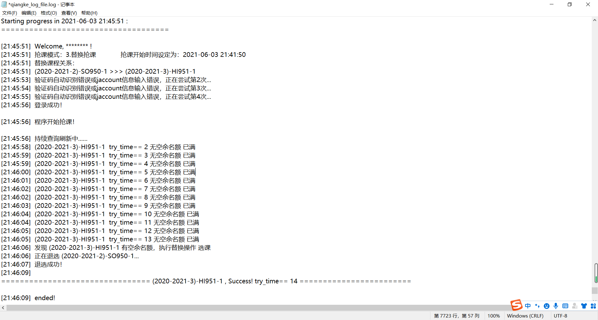
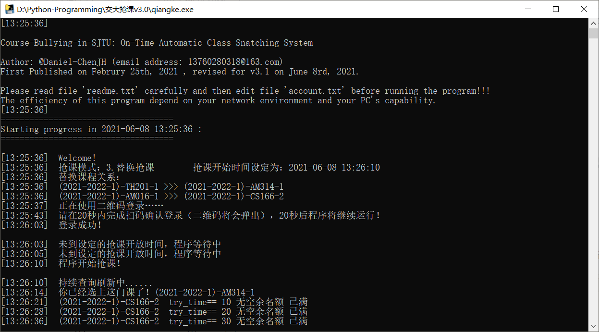
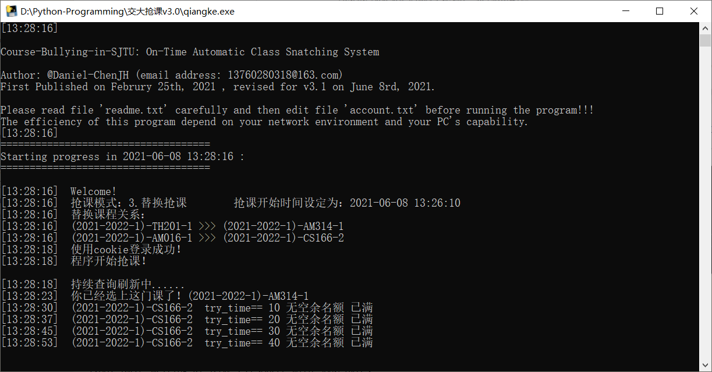

# Welcome to Course-Bullying-in-SJTU-v4.0！

## 2021/7/2 v4.0 更新说明

1. **编写了GUI界面并与原脚本对接，提供更好的用户体验，打包好的exe文件可直接运行。**
2. **对原有脚本模式三（替换抢课）下的微小代码谬误予以修正，对代码结构予以优化。**
3. **更新后程序暂时不再开源**，目前只支持Windows10用户，若您使用其他操作系统请您与我沟通联系。**另外，请勿在开启VPN代理情况下使用本程序！**
4. **打包发布的exe文件不需其他任何依赖即可使用，所有操作都将在exe文件的用户界面中完成。**
5. qiangke_log_file.log 文件的生成路径移动到了当前目录的user文件夹下。user文件夹会自动创建。
6. 如有任何疑问请联系13760280318@163.com并说明来意。

## 2021/6/8 v3.1 更新说明

1. 为了更好地保护用户隐私，将原来用户名+密码的登录方式改为微信扫二维码+cookie登录方式，**不再需要配置使用pytesseract**。在使用扫码登录模式时，请稍等，二维码将马上弹出。**请在15秒内完成扫码确认，15秒后程序将继续运行**。当距离本地保存的cookie的过期时间不足2小时时，需要重新扫码登录。
2. 对代码进行了优化，稍稍降低了代码运行速度，对各个模式都进行了优化，对模式3的退课环节增加多重保险。针对服务器不稳定时的代码策略进行了优化，提升了程序鲁棒性。
3. 对模式3的**补充说明**：
   1. 当教学信息服务网短时间内流量过大时，会导致服务器出现问题，比如一直加载但上不去、404、Service Unavailable等报错。这种是服务器端的问题，脚本也无能为力。因此，在抢课准点开放时，脚本使用的效率不能保证，强烈建议您同时手动抢课尝试。
   2. **在学校服务器压力较大时段，不建议使用模式3**。模式3带有退课功能，如果因为服务器不稳定而给脚本返回了错误的结果，可能会导致脚本退掉原本已经选上的课，并且没有能选上目标课程。相反，模式1、模式2均为只选不退，因此没有类似风险。
   3. 由于模式3的特殊性以及网页刷新需要一定的加载时间，有可能出现查询到课程A有空余名额，立即前往退掉课程B，返回尝试选课程A时发现已经被人捷足先登的情况。这种情况下，不仅B被退掉了，而且A也没选上。
   4. 由于模式3的特殊性，建议运行模式3时请勿离开，并定时关注程序运行情况。**若有退课行为，建议立即前往教学信息服务网确认。**
   5. **本程序致力于给各用户带来更好的用户体验，也将对其中出现的问题进行优化。模式3目前在本人的电脑上运行正常。但是，考虑到模式3的特殊性以及个人网络环境、电脑配置等方面的差异性，对于模式3的潜在用户，本程序不对其行为及脚本运行结果负任何责任。运行模式3的用户将被默认为对此补充说明已知悉。**

# 模式介绍

## 模式1：准点开抢

**用于准点开放抢课。**

由用户指定开抢的时间，格式为'%Y-%m-%d %H:%M:%S'。范例如：2021-05-24 17:35:20 。考虑到本程序登录系统需要时间，请在抢课开放前提前约30秒至1分钟即开始运行本程序。如果您希望程序一运行就立即开始抢课，您当然可以在此填入一个过去的时间。

## 模式2：持续捡漏

**用于抢课已经开放后持续查询。** 用户界面中指定开抢的时间那一栏将不被程序考虑。

## 模式3：替换抢课

**注意！此处课程写法有关键变化！注意！此处课程写法有关键变化！注意！此处课程写法有关键变化！！！！**

**为了保险，请您在使用模式三时只使用课号检索！请先确定需要替换的即被替换的课程课号，并确保您已经选上了您准备“被替换”的课程！！！**

该模式致力于提供这样一种服务：

**在用户已经选择好课程B的情况下，他可能有一门更想去的但是由于某些原因没法同时选择的课A（如通识课只能选一门、时间冲突等），且课A此时已经属于满员状态。**

**程序持续刷新课程A的情况，一旦课程A有空余名额，立即退掉课程B并选择课程A，即“替换抢课”，从而帮助使用者确保：即使抢不到更好的课A，至少原来选上的课程B不会丢失。**

**在使用模式3时，请自行确保您已经选上课程A，否则程序或许会报错而不能执行。为保险起见，请在运行完此模式后立即自行前往教学信息服务网确认抢课结果。**

具体写法可参考GUI用户界面的提示。

模式3同样需要由用户指定开抢的时间，格式为'%Y-%m-%d %H:%M:%S'。范例如：2021-05-24 17:35:20 。考虑到本程序登录系统需要时间，请在抢课开放前提前约30秒至1分钟即开始运行本程序。如果您希望程序一运行就立即开始抢课，您当然可以在此填入一个过去的时间。

# 使用说明

上海交通大学全自动抢课脚本，支持准点开抢与抢课后持续捡漏两种模式。2021/06/03更新v3.0版本。

这是一个上海交通大学定时自动抢课系统，由Daniel-ChenJH(邮箱:13760280318@163.com)编写，于2021年2月25日首次编辑，2021年7月2日修改（最近）。

该可执行程序(Course-Bullying-in-SJTU.exe文件)目前只能在Windows x86_64电脑上运行，但源代码脚本也可以在mac电脑上运行。该程序基于https://i.sjtu.edu.cn 网站的当前结构编写。 https://i.sjtu.edu.cn  是上海交通大学学生处理个人事务的网站，学生可以在此选择下学期的课程。

本程序支持准点开抢、持续捡漏、替换抢课三种模式。但是，您应该只在抢课开放时间段附近时段使用它，否则该程序可能无法工作并抛出错误。

通过使用这个程序，您将能够立即选择您指定的课程。如果您想选择的课程目前已经满员,程序将会持续刷新网站页面,以每分钟80次左右的刷新速度检查是否有剩余名额,一旦有空余名额,程序将立即帮您选择这门课。

请注意不要经常使用这个程序，因为凭借它您几乎可以在任何时间持续刷新检查所有您想要的课程，您的同学可能会因此而生气。

---

# 声明

作者(@Daniel-ChenJH)对可能使用本程序的潜在用户不承担任何责任。

至少目前学校不会禁止短时间内不断刷新页面的IP或Jaccount，所以您可以放心使用它。

# 使用方法

1. 解压zip文件;
2. 确保您的网络环境正常，而且电脑上安装好了Chrome浏览器(91.0.4472系列)且运转正常。
   本程序将会用到谷歌浏览器自动控制程序chromedriver，属于本程序的必须文件，本程序会自动检索版本并下载配置好环境。
3. 在程序页面的填空栏指定位置中添加您想要选择的课程!!

每行为一个课程和它的课程类别!（如主修课程，民族生课程，留学生及港澳台生，通识课通选课，交叉课程，任选课程等。）
您可以在每一行的第一个填空栏填写您想要的课程名称,老师名称或者课程编号，对于每一个您想选的课程您只需写上述三条信息之一。但是我强烈建议您在这里写下课程编号，这样可以得到最准确的课程信息。
对于模糊课程名如：“高等数学，主修课程“，程序会默认为您刷新系统返回的第一个班级的空余名额。
如果此班级没有空余名额，程序也不会找寻相应课程的其它老师的班级，以免错选而带来不必要的麻烦。
**因此如果您想选择特定时间段、特定老师的课程，请您提前查询好相应的课程编号并写在程序页面的对应位置中。**

如果您想在抢选阶段开放时立刻使用本程序，请在海选阶段留个心眼，将您很想选上的课程编号记录下来，以便在海选阶段开始前填入程序页面中。

4. 如果您想选择多个班级，只需在下面几行中输入它们和它们的课程类别。

然而，太多的课程可能会导致程序的效率下降，因此不建议同时抢四门或以上的课程。

5. 虽然本程序的模式1、模式2不会退掉您目前所选的课程，但还是强烈建议您确保您的目标课程预期时间表没有时间冲突。
6. 点击'开始运行脚本'按钮启动进程，耐心等待程序运行，并仔细阅读程序日志。
7. 若程序运行在'替换抢课'模式下并以任何形式终止，请您先自行登录教学信息服务网，并检查、尝试选课操作。请在自查一下四点后尝试再次运行程序。

（1）您的jaccount信息完全正确！！！
（2）完成所有上学期评教
（3）您的课程信息输入均正确，这些课程目前都已经可以被选择，且与您目前的时间表没有时间冲突
（4）您的网络环境良好

8. 若因为抢课人数过多导致学校教学信息服务网服务器崩溃，本程序也无能为力。因此建议您在运行此程序的同时也自行前往教学信息服务网尝试抢课，以增加成功率。
9. 请注意，不要同时运行多次本程序，这有可能导致其中只有一个运行窗口能运行或产生异常。

# 程序运行效果

### 最新效果-GUI页面

### 此前效果-命令行页面（已经不再使用，但使用效果类似）

程序的运行状况会被实时更新到位于当前目录下'user'文件夹中的log文件：qiangke_log_file.log中。下图展示了程序成功执行模式3的情况。

之前v3.1版本中更改为二维码+cookie登录的程序效果：可以看到，使用cookie大大提升了登录速度。

扫码登录：

使用本地cookie登录：

# 鼓励--创作不易，请勿白嫖!

Daniel-ChenJH学艺尚浅，这是他个人在Github的第一个大项目。

本项目的几次大更新花费了他非常多的时间，甚至占用了期末考试复习时间。

如果您觉得Daniel-ChenJH的程序不错，请在Github上点亮“star”以给他一点鼓励。
项目链接：https://github.com/Daniel-ChenJH/Course-Bullying-in-SJTU

祝君好运!

Daniel-ChenJH,  
2021.07.02.

# 联系

对于任何使用问题或讨论，请随时联系13760280318@163.com，如果是关于程序运行失败的讨论，请于附件中加上您的使用日志log文件‘qiangke_log_file.log‘（在当前目录下的user文件夹中），并于邮件中注明具体是哪一次运行（程序开始运行的时间）出了问题。
