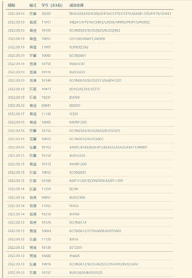
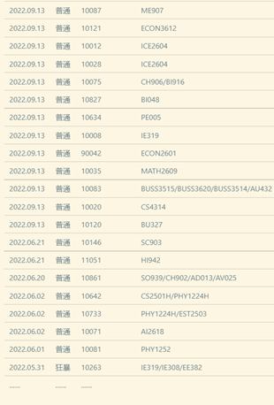

# Welcome to Course-Bullying-in-SJTU-Memorial edition！

This is a project that aims to help SJTU undergraduates to choose the course they like within the limited quotas.
The program keeps monitoring the number of remaining places of courses in real time and select them as soon as there are places available.

Total Hits:    

---

# 声明

**出于学校相关规章制度，本项目已停止服务、相关代码已无法使用。本项目的作者Daniel-ChenJH不会再对原项目的使用提供任何帮助。**

**本项目如今重新公开，仅做展示个人项目经历所用，不再开放选课相关功能，代码也不会再次更新。未经本人书面同意，任何人或单位不得对本项目代码进行二次开发或使用。对违规使用的用户，项目作者将会及时向Github提DMCA要求下架。同时，使用本程序所带来的所有后果均由使用者承担，项目作者概不负责。**

---

# 项目介绍

**本程序针对上海交通大学本科生选课网站 https://i.sjtu.edu.cn 使用。项目使用urllib、selenium库实现网页自动化爬取、使用tkinter自定义用户交互UI界面、使用poplib管理邮箱作为信息中转服务器。**

**程序使用过程中，用户在UI界面中定义抢课策略、抢课时间、课程名等信息后开始抢课，由程序的爬虫部分完成抢课任务后自动向项目邮箱发送包含本次抢课信息的邮件，完成一次抢课任务。**

**截止2022/09/19项目下架时，本项目主页总点击量达到了6500+，抢课期间单周最大访问量达到900+，获得了92+个star。经统计，在2022/9/13至2022/9/19的7天时间内，程序总计帮助53位同学抢到了84门课。**

Daniel-ChenJH,  
2023.10.15.

---

### 项目页面

### 部分抢课成功记录

<figure class="half">
    
    
</figure>

---

## 程序说明

本程序为上海交通大学全自动抢课脚本，可在Windows64和Mac两大主流操作系统上运行，支持准点开抢、持续捡漏、替换抢课三种模式，由Daniel-ChenJH编写，于2021年2月25日首次推出。

本程序基于https://i.sjtu.edu.cn 网站的当前结构编写。 https://i.sjtu.edu.cn  是上海交通大学本科生处理个人事务的网站，学生可以在此选择下学期的课程。

通过使用这个程序，您将能够立即选择您指定的课程。如果您想选择的课程目前已经满员,程序将会持续刷新网站页面,以每分钟80次左右的刷新速度检查是否有剩余名额,一旦有空余名额,程序将立即帮您选择这门课。

## 使用方法

1. **确保您的网络环境正常未使用VPN，电脑上安装好了Chrome浏览器且运转正常。**
2. 解压本程序。Windows系统请运行文件：WIN64-Course-Bullying-in-SJTU.exe，MAC系统请运行文件：MAC-Course-Bullying-in-SJTU.dmg，并按照程序页面提示操作即可。
3. **若因为抢课人数过多导致学校教学信息服务网服务器崩溃，本程序也无能为力。因此建议您在运行此程序的同时也自行前往教学信息服务网尝试抢课，以增加成功率。**
4. 请注意，不要同时运行多次本程序，这有可能导致其中只有一个运行窗口能运行或产生异常。
5. 对MAC OS用户的特殊说明：
   1. 当打开脚本程序遇到系统提示“因为它来自身份不明的开发者”信息时，这时请先打开“ **系统偏好设置”** 应用，点击“安全与隐私”选项，在页面的下半部分即可看见“已阻止打开MAC-Course-Bullying-in-SJTU”,则只需点击后面的“仍要打开”按钮，并再次尝试打开程序即可。
   2. 由于MAC OS的系统问题，程序生成的全部文件（包括日志文件与软件更新时下载的新软件）都会放在home根目录下，即电脑用户名称的文件夹。路径的打开方法为：进入电脑桌面，切换到Finder模式，然后找到顶部菜单栏里面的“前往”-“前往文件夹”，接着在输入框里面只输入一个“~”符号，然后点击“前往”按钮，即可打开home文件夹。

--------------------

## 模式介绍

### 模式1：准点开抢

**用于准点开放抢课。支持课号选课、课程名选课以及按“课程名：老师名”匹配原则选课。**

### 模式2：持续捡漏

**用于抢课已经开放后持续查询。支持课号选课、课程名选课以及按“课程名：老师名”匹配原则选课。** 

### 模式3：替换抢课

**注意！此处课程写法有关键变化！模式三只支持使用课号检索！**

**当用户已经选上课程B时，他可能有一门更想去的但没法与B同时选择的课A，且课A此时已经属于满员状态。在模式3下程序将持续刷新课程A的情况，一旦发现A有空余名额，立即退掉B并选择A，即“替换抢课”。**

**在使用模式3时，请自行确保您已经选上课程A，否则程序或许会报错而不能执行。为保险起见，请在运行完此模式后立即自行前往教学信息服务网确认抢课结果。**

具体写法可参考GUI用户界面的提示。

------------

## 鼓励--创作不易，请勿白嫖

如果您觉得Daniel-ChenJH的程序不错，请在Github上点亮“star”以给他一点鼓励。
项目链接：https://github.com/Daniel-ChenJH/Course-Bullying-in-SJTU

祝君好运!

Daniel-ChenJH,  
2022.09.13.

## 联系

出于学校相关规章制度，本项目已停止服务、无法使用。本项目的作者Daniel-ChenJH不会再对本项目的使用提供任何帮助。

若您对本项目的结构与实现方法感兴趣，则欢迎在issue中联系作者进行讨论。

## 致谢

本程序检测Chrome浏览器与驱动版本的对应情况的部分代码来自Gitee社区开发者@z417_admin的项目[selenium-webdriver-manager](https://gitee.com/z417_admin/selenium-webdriver-manager)，在此表示感谢。
