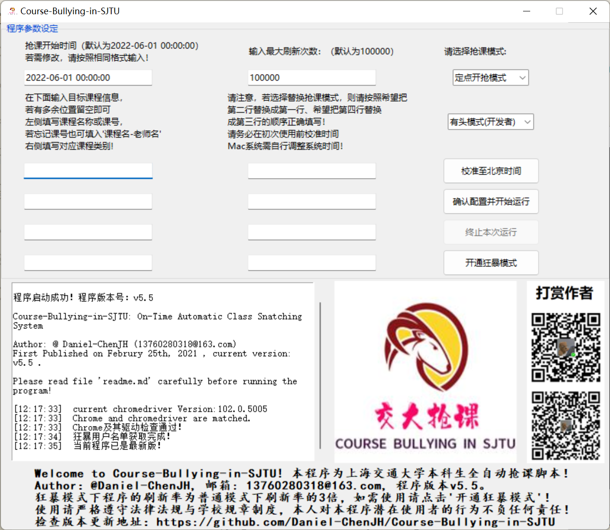

# Welcome to Course-Bullying-in-SJTU-v5.5！

This is a project that aims to help SJTU undergraduates to choose the course they like within the limited quotas.
The program keeps monitoring the number of remaining places of courses in real time and select them as soon as there are places available.

Total Hits:    

# 声明

本程序针对上海交通大学**本科生**选课网站 https://i.sjtu.edu.cn 使用。

作者(@Daniel-ChenJH)对可能使用本程序的潜在用户的行为不承担任何责任，使用本程序所带来的任何潜在风险均由使用者承担。

当程序使用出现问题时，请先在"有头模式"下运行程序，观察网页变化试试。若实在无法解决，请邮件联系作者13760280318@163.com寻求帮助。

# 2022/09/13 v5.5 版本更新说明

1. 修复了v5.4及以前版本的抢课代码中一个久未发现的关键bug，因此请务必将您的程序更新至v5.5版本使用，v5.4及以前版本的程序将不再被支持。在此感谢孙同学的问题反馈。
2. 新增付费模式：“狂暴模式（无头）”。狂暴模式下，程序将解锁刷新次数上限且刷新率提升3倍，能帮您在抢课大军以及众多脚本用户中脱颖而出。开通方法请参见程序的“开通狂暴模式”按钮。开通成功后，请将选课模式调整至“狂暴模式（无头）”。
3. 无头、有头模式均为免费使用，不受影响。点击“开始运行”后，将在运行按钮处显示脚本当前的运行模式。
4. 添加了成功抢课后信息反馈模块。
5. MAC版程序体积大幅减小。
6. 如果程序登录成功后持续报错IndexError: list index out of range，请下载9.13更新的最新版WIN64-Course-Bullying-in-SJTU-v5_5.exe即可。如果没出现这个报错则不需要更新。

# 程序说明

本程序为上海交通大学全自动抢课脚本，可在Windows64和Mac两大主流操作系统上运行，支持准点开抢、持续捡漏、替换抢课三种模式，由Daniel-ChenJH(邮箱:13760280318@163.com)编写，于2021年2月25日首次推出。

本程序基于https://i.sjtu.edu.cn 网站的当前结构编写。 https://i.sjtu.edu.cn  是上海交通大学本科生处理个人事务的网站，学生可以在此选择下学期的课程。

通过使用这个程序，您将能够立即选择您指定的课程。如果您想选择的课程目前已经满员,程序将会持续刷新网站页面,以每分钟80次左右的刷新速度检查是否有剩余名额,一旦有空余名额,程序将立即帮您选择这门课。

请注意不要经常使用这个程序，因为凭借它您几乎可以在任何时间持续刷新检查所有您想要的课程，您的同学可能会因此而生气。

---

# 使用方法

1. **确保您的网络环境正常未使用VPN，电脑上安装好了Chrome浏览器且运转正常。**
2. 解压本程序。Windows系统请运行文件：WIN64-Course-Bullying-in-SJTU.exe，MAC系统请运行文件：MAC-Course-Bullying-in-SJTU.dmg，并按照程序页面提示操作即可。
3. **若因为抢课人数过多导致学校教学信息服务网服务器崩溃，本程序也无能为力。因此建议您在运行此程序的同时也自行前往教学信息服务网尝试抢课，以增加成功率。**
4. 请注意，不要同时运行多次本程序，这有可能导致其中只有一个运行窗口能运行或产生异常。
5. 对MAC OS用户的特殊说明：
   1. 当打开脚本程序遇到系统提示“因为它来自身份不明的开发者”信息时，这时请先打开“ **系统偏好设置”** 应用，点击“安全与隐私”选项，在页面的下半部分即可看见“已阻止打开MAC-Course-Bullying-in-SJTU”,则只需点击后面的“仍要打开”按钮，并再次尝试打开程序即可。
   2. 由于MAC OS的系统问题，程序生成的全部文件（包括日志文件与软件更新时下载的新软件）都会放在home根目录下，即电脑用户名称的文件夹。路径的打开方法为：进入电脑桌面，切换到Finder模式，然后找到顶部菜单栏里面的“前往”-“前往文件夹”，接着在输入框里面只输入一个“~”符号，然后点击“前往”按钮，即可打开home文件夹。

# 模式介绍

## 模式1：准点开抢

**用于准点开放抢课。支持课号选课、课程名选课以及按“课程名：老师名”匹配原则选课。**

由用户指定开抢的时间，格式为'%Y-%m-%d %H:%M:%S'。范例如：2021-05-24 17:35:20 。考虑到本程序登录系统需要时间，请在抢课开放前提前约30秒至1分钟即开始运行本程序。如果您希望程序一运行就立即开始抢课，您当然可以在此填入一个过去的时间。

当教学信息服务网短时间内流量过大时，会导致服务器出现问题，比如一直加载但上不去、404、Service Unavailable等报错。这种是服务器端的问题，脚本也无能为力。因此，在抢课准点开放时，脚本使用的效率不能保证，强烈建议您同时手动抢课尝试。

## 模式2：持续捡漏

**用于抢课已经开放后持续查询。支持课号选课、课程名选课以及按“课程名：老师名”匹配原则选课。** 用户界面中指定开抢的时间那一栏将不被程序考虑。

## 模式3：替换抢课

**注意！此处课程写法有关键变化！模式三只支持使用课号检索！**

**当用户已经选上课程B时，他可能有一门更想去的但没法与B同时选择的课A，且课A此时已经属于满员状态。在模式3下程序将持续刷新课程A的情况，一旦发现A有空余名额，立即退掉B并选择A，即“替换抢课”。**

**在使用模式3时，请自行确保您已经选上课程A，否则程序或许会报错而不能执行。为保险起见，请在运行完此模式后立即自行前往教学信息服务网确认抢课结果。**

具体写法可参考GUI用户界面的提示。

对模式3的**补充说明**：

1. 由于模式3的特殊性以及网页刷新需要一定的加载时间，有可能出现查询到课程A有空余名额，立即前往退掉课程B，返回尝试选课程A时发现已经被人捷足先登的情况。这种情况下，不仅B被退掉了，而且A也没选上。
   因此，建议运行模式3时请勿离开，并定时关注程序运行情况。**若程序记录有退课、换课行为，建议立即前往教学信息服务网确认。**
2. **本程序致力于给各用户带来更好的用户体验，也将对其中出现的问题进行优化。模式3目前在本人的电脑上运行正常。但是，考虑到模式3的特殊性以及个人网络环境、电脑配置等方面的差异性，对于模式3的潜在用户，本程序不对其行为及脚本运行结果负任何责任。运行模式3的用户将被默认为对此补充说明已知悉。**

# 程序运行效果

### GUI页面

## 成功案例

注：此处持续不定期更新使用v5.4以上版本（2022/05/31及以后）程序抢课成功的案例。

| 时间  |  模式     | 学号（末5位） | 成功选课                |
| ----- | ----- | ------------- | ----------------------- |
| 2022.09.19 | 狂暴 | 10265  | EE453/EE450/IE308/IE319/CS179/PJ179/MARX1205/CH931/CS179 |
| 2022.09.19 | 普通 | 11011  | PU917/ME501/AR902/MT910/MU902/CS902/LA938 |
| 2022.09.19 | 普通 | 10105  | ECON3503/BUSS3620/BUSS2402 |
| 2022.09.19 | 普通 | 10051  | AN417/AR909/LIS1200 |
| 2022.09.19 | 普通 | 11007  | EE382/IE308 |
| 2022.09.19 | 狂暴 | 10082  | ECON3601 |
| 2022.09.19 | 普通 | 10750  | PE001C07 |
| 2022.09.19 | 普通 | 10110  | BUSS3620 |
| 2022.09.19 | 普通 | 10149  | 劳动经济学/BUSS2515/高等数学 |
| 2022.09.19 | 狂暴 | 10473  | EE372/EE383/EE453 |
| 2022.09.19 | 狂暴 | 10231  | BU366 |
| 2022.09.19 | 普通 | 90041  | EE0501 |
| 2022.09.17 | 普通 | 11135  | 电子系统智能化设计——理论与实践 |
| 2022.09.16 | 普通 | 10003  | MARX1203 |
| 2022.09.16 | 狂暴 | 10155  | ECON3503/BUSS3505/BUSS3620 |
| 2022.09.16 | 狂暴 | 10013  | ECON3610/BUSS3602 |
| 2022.09.16 | 狂暴 | 10163  | AR901/EE425/EE4320/AR007/EE411/EE4322/EE415 |
| 2022.09.15 | 狂暴 | 10159  | BUSS3503 |
| 2022.09.15 | 普通 | 10113  | MARX1203 |
| 2022.09.15 | 狂暴 | 10012  | ECON3501 |
| 2022.09.15 | 狂暴 | 10160  | MATH1201/MATH1205/ECON2404 |
| 2022.09.14 | 狂暴 | 11250  | EE391 |
| 2022.09.14 | 普通 | 90057  | BUSS2406 |
| 2022.09.14 | 普通 | 11055  | EE453 |
| 2022.09.14 | 普通 | 10216  | BU366 |
| 2022.09.13 | 普通 | 10126  | ECON3514 |
| 2022.09.13 | 普通 | 10004  | ECON3608/ECON3612/BUSS3602 |
| 2022.09.13 | 狂暴 | 11120  | BI916 |
| 2022.09.13 | 普通 | 10139  | EST2501 |
| 2022.09.13 | 普通 | 10682  | PH445 |
| 2022.09.13 | 狂暴 | 10016  | ECON3612/BUSS3620/ECON3610/BUSS3602 |
| 2022.09.13 | 狂暴 | 10157  | BUSS3620/BUSS3520 |
| 2022.09.13 | 普通 | 10087  | ME907 |
| 2022.09.13 | 普通 | 10121  | 区域经济学 |
| 2022.09.13 | 普通 | 10012  | ICE2604 |
| 2022.09.13 | 普通 | 10028  | ICE2604 |
| 2022.09.13 | 普通 | 10075  | BI916/CH906 |
| 2022.09.13 | 普通 | 10827  | 近代显微学 |
| 2022.09.13 | 普通 | 10634  | PE005 |
| 2022.09.13 | 普通 | 10008  | IE319 |
| 2022.09.13 | 普通 | 90042  | ECON2601 |
| 2022.09.13 | 普通 | 10035  | MATH2609 |
| 2022.09.13 | 普通 | 10083  | BUSS3514/BUSS3620/BUSS3515/AU432 |
| 2022.09.13 | 普通 | 10020  | CS4314 |
| 2022.09.13 | 普通 | 10120  | BU327 |
| 2022.06.21 | 普通 | 10146         | SC903                   |
| 2022.06.21 | 普通 | 11051         | HI942                   |
| 2022.06.20 | 普通 | 10861         | SO939/CH902/AD013/AV025 |
| 2022.06.02 | 普通 | 10642         | CS2501H/PHY1224H        |
| 2022.06.02 | 普通 | 10733         | PHY1224H/EST2503        |
| 2022.06.02 | 普通 | 10071         | AI2618                  |
| 2022.06.01 | 普通 | 10081         | PHY1252                 |
| 2022.05.31 | 狂暴 | 10263         | IE319/IE308/EE382       |
| ……       | ……          | ……                    |

# 鼓励--创作不易，请勿白嫖

Daniel-ChenJH学艺尚浅，这是他个人在Github的第一个大项目。

本项目的几次大更新花费了他非常多的时间，甚至占用了期末考试复习时间。

如果您觉得Daniel-ChenJH的程序不错，请在Github上点亮“star”以给他一点鼓励。
项目链接：https://github.com/Daniel-ChenJH/Course-Bullying-in-SJTU

祝君好运!

Daniel-ChenJH,  
2022.09.13.

# 联系

对于任何使用问题或讨论，请联系13760280318@163.com。如果是关于程序运行失败的讨论，请于附件中加上您的使用日志log文件‘user/qiangke_log_file.log‘（在当前目录下的user文件夹中），并于邮件中注明具体是哪一次运行（程序开始运行的时间）出了问题。

# 致谢

本程序检测Chrome浏览器版本与驱动版本的对应情况的部分代码来自Gitee社区开发者“少年二师兄”（@z417）的项目“selenium-webdriver-manager”，在此表示感谢。
